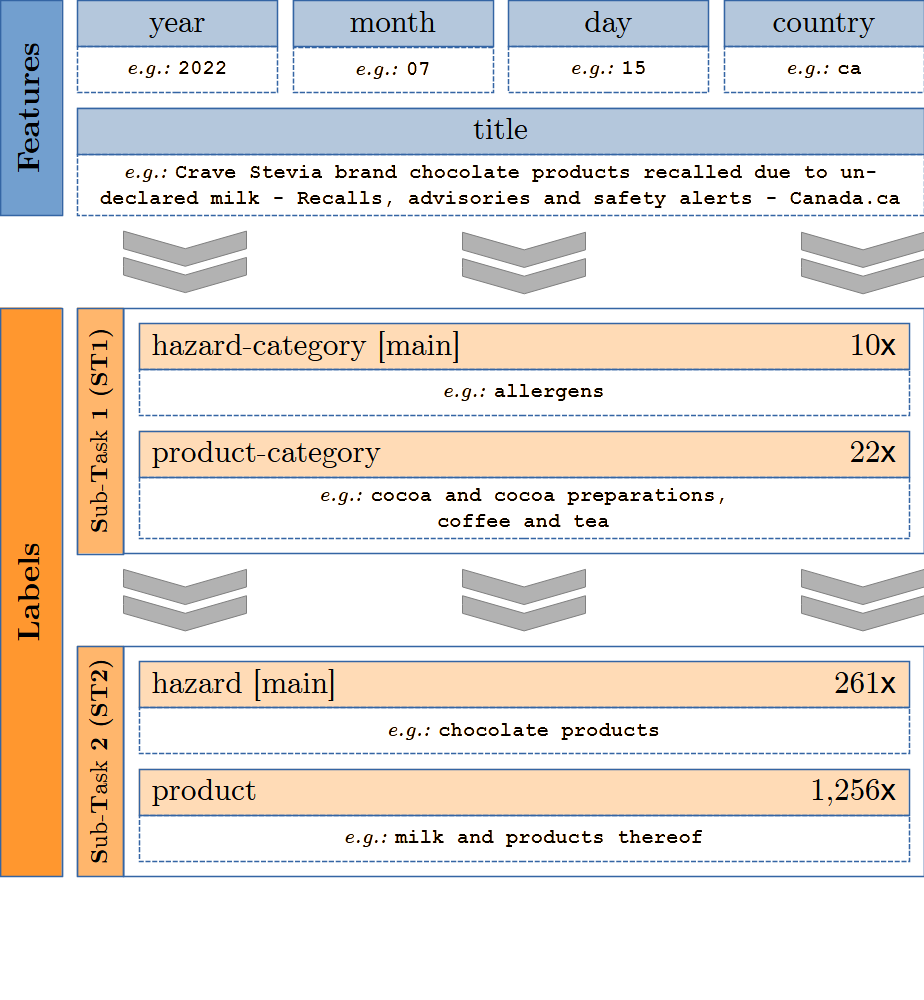
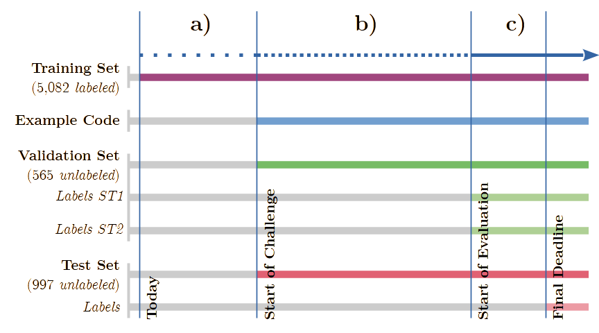
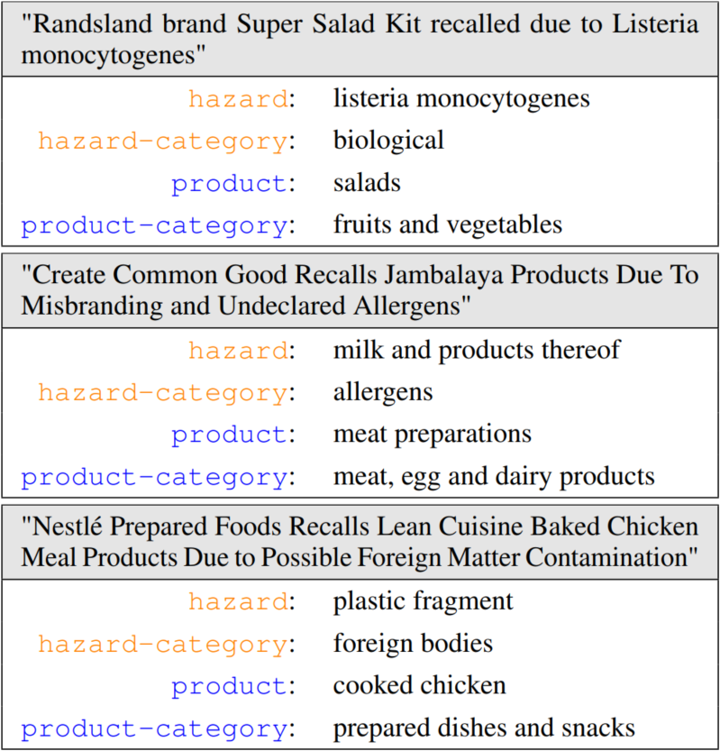

> ### 🔱 This is a fork.
>
> The task, the dataset, the baselines and everything below this box are the work of the **[SemEval 2025 Task 9 organizers](#task-organizers)**, preserved unchanged. I have added one thing: my own solution to the challenge, in [`solution/`](solution/).
>
> **→ [Jump to my solution](#my-solution)** — a RoBERTa-large system scoring **0.7895** on Sub-Task 1 under the organizers' own metric.
>
> I did **not** compete in the official challenge. This was built afterwards, as a university exercise, on the publicly released data.

---

# SemEval 2025 Task 9: The Food Hazard Detection Challenge

The Food Hazard Detection task evaluates explainable classification systems for titles of food-incident reports collected from the web. These algorithms may help automated crawlers find and extract food issues from web sources like social media in the future. Due to the potential high economic impact, transparency is crucial for this task.

<div align="center">
   
   <p>Figure 1: <i>The blue boxes are model inputs; the orange boxes are ground truth labels per sub-task.
      The number on the right indicates unique values per label.</i></p>
</div>

Figure 1 shows a sample of the dataset. The data features "year," "month," "day," "country," and "title". Additionally, we provide the full text of the recall in the column "text." Participants will base their analysis on either the "title" or the "text" feature (indicating which one they used). The task is to predict the labels "product-category" and "hazard-category" and the vectors "product" and "hazard." The class distribution is heavily imbalanced. The data includes 1,142 different products (e.g., "ice cream," "chicken based products," "cakes") sorted into 22 categories (e.g., "meat, egg and dairy products," "cereals and bakery products," "fruits and vegetables"). The 128 possible "hazard"-values (e.g., "salmonella," "listeria monocytogenes," "milk and products thereof") are sorted into 10 "hazard-category" values.

The SemEval-Task combines **two sub-tasks**:
- **(ST1)** Text classification for food hazard prediction, predicting the type of hazard and product.
- **(ST2)** Food hazard and product "vector" detection, predicting the exact hazard and product.

The task focuses on detecting the hazard and uses a two-step scoring metric based on the macro F1 score, focusing on the hazard label per sub-task.

# Task Organization

<div align="center">
   
   <p>Figure 2: <i>Challenge timeline: (a) Trial Phase; (b) Conception Phase; (c) Evaluation Phase.</i></p>
</div>

The timeline is shown in Figure 2. Participants get training and validation data to build, train, and assess their systems before the evaluation period. The challenge takes place on [Codalab](https://codalab.lisn.upsaclay.fr/competitions/19955) and will be divided into **four phases** (all deadlines AoE time):

1. **Trial Phase** (*before September 2nd 2024*)
   - [Labeled trial/training data (5,082 samples)](https://github.com/food-hazard-detection-semeval-2025/food-hazard-detection-semeval-2025.github.io/tree/main/data/incidents_train.csv) are available for devising and training models.

2. **Conception Phase** (*September 2nd 2024 to January 10th 2025*)
   - [Unlabeled validation data (565 samples)](https://codalab.lisn.upsaclay.fr/my/datasets/download/26c12bc0-3878-4edf-8b4a-9682763c0b7e) are released
   - [Unlabeled test data (997 samples)](https://codalab.lisn.upsaclay.fr/my/datasets/download/5695a2da-4c2b-4447-8c0c-2a30252f648c) are released
   - [Codalab](https://codalab.lisn.upsaclay.fr/competitions/19955) accepts separate trial submissions for ST1 (category classification) and ST2 (vector classification) **on the validation data**. Only the predictions in **.csv** format (zipped) will be uploaded.

3. **Evaluation Phase** (*January 10th 2025 to January 17th 2025*)
   - [Labeled validation data (ST1 and ST2)](https://github.com/food-hazard-detection-semeval-2025/food-hazard-detection-semeval-2025.github.io/tree/main/data/incidents_valid.csv) are released
   - [Codalab](https://codalab.lisn.upsaclay.fr/competitions/19955) accepts final submissions for both tasks **on the test data**. Only the predictions in **.csv** format (zipped) will be uploaded.

4. **Paper Phase** (*January 17th 2025 to February 28th 2025*)
   - [Labeled test data (ST1 and ST2)](https://github.com/food-hazard-detection-semeval-2025/food-hazard-detection-semeval-2025.github.io/tree/main/data/incidents_test.csv) are released
   - Participants describe their systems in scientific papers and commit them to [SemEval 2025](https://semeval.github.io/SemEval2025/)

The two stages of the Conception Phase are intended to enable participants to compare their submission to each of the sub-tasks to other participants' approaches. Therefore, we encourage uploading approaches for both sub-tasks of the conception phase to get a feel for the competition.

**Explainability** in food risk classification based on texts is currently underexplored although it may help humans quickly assess prediction validity and can be used for meta-learning approaches like clustering or pre-sorting examples. However, explanations can be diverse and task/model-dependent. Current literature includes both model-specific ([Assael et al., 2022](https://www.nature.com/articles/s41586-022-04448-z); [Pavlopoulos et al., 2022](https://aclanthology.org/2022.acl-long.259/)) and model agnostic ([Ribeiro et al., 2016](https://aclanthology.org/N16-3020/)) approaches. We aim to study mechanisms to explain decisions on food safety risks by asking participants to submit precise "vector"-labels (ST2) as explanations for their ST1 predictions.

Example code for this task can be found [here](https://github.com/food-hazard-detection-semeval-2025/food-hazard-detection-semeval-2025.github.io/tree/main/code).

# Dataset

<div align="center">
   
   <p>Figure 3: <i>Sample texts with labels.</i></p>
</div>

The dataset for this task consists of 6,644 short texts (length in characters: min=5, avg=88, max=277). Sample texts are shown in Figure 3. It includes manually labeled English food recall titles from official food agency websites (e.g., FDA). Each text is labeled by two food science or food technology experts. Upon task completion, the full dataset will be available under the Creative Commons BY-NC-SA 4.0 license on [Zenodo](https://zenodo.org/doi/10.5281/zenodo.10820657).

# Evaluation

We compute the performance for ST1 and ST2 by calculating the macro-F<sub>1</sub>-score on the participants' predicted labels (`hazards_pred` & `products_pred`) using the annotated labels (`hazards_true` & `products_true`) as ground truth. The exact scoring function is provided here:

```python
from sklearn.metrics import f1_score

def compute_score(hazards_true, products_true, hazards_pred, products_pred):
  # compute f1 for hazards:
  f1_hazards = f1_score(
    hazards_true,
    hazards_pred,
    average='macro'
  )

  # compute f1 for products:
  f1_products = f1_score(
    products_true[hazards_pred == hazards_true],
    products_pred[hazards_pred == hazards_true],
    average='macro'
  )

  return (f1_hazards + f1_products) / 2.
```

With this measure, we base our rankings predominantly on the predictions for the hazard classes. Intuitively, this means that a submission with both `hazards_pred` and `products_pred` completely right will score 1.0, a submission with `hazards_pred` completely right and `products_pred` completely wrong will score 0.5, and any submission with `hazards_pred` completely wrong will score 0.0 independently of the value of `products_pred`.

# Leaderboard

Here you can find the final leaderboard of the task:

<iframe src="https://docs.google.com/spreadsheets/d/e/2PACX-1vSHGZQIN_As8etpiZdpIFOl0tCFArK3FA1N7d4yiScAt7hfoj8LEZzYh2jk3XmZjp_hoCajOJddaj0b/pubhtml?widget=true&amp;headers=false" frameborder="1" width="100%" scrolling="yes" height="500px"></iframe>

# Task Organizers

The organizers are:

- **Korbinian Randl** (lead) is a PhD student at Stockholm University. His research centers around machine learning for NLP and explainability. He works on applying these interests in food risk prediction.
- **John Pavlopoulos** (lead) is Assistant Professor at Athens University of Economics and Business and has co-organized BioASQ, HTREC, and SemEval Tasks 4 (2014) and 5 (2021). He is also affiliated with Stockholm University and Archimedes/Athena RC.
- **Aron Henriksson** is an associate professor at Stockholm University working on machine learning for NLP in healthcare and education.
- **Tony Lindgren** is Stockholm University's project leader for the EFRA project.
- **George Marinos** is a PhD student at Wageningen University & Research and AI Research Engineer in Agroknow, focusing on AI for forecasting food safety risks.
- **Manos Karvounis** is the research and innovation manager and the team leader of the R&D department in Agroknow, and the project coordinator of EFRA.

You can contact the organizers using [this email address](mailto:food-hazard-detection-semeval-2025@googlegroups.com).

# Ethical statement

All texts come from official and publicly available sources, so no privacy issues are present. All annotations are provided by Agroknow experts. The systems are intended to complement but not substitute human experts in preventing illness or harm from food sources.

<table>
   <tr>
      <td style="width:118px"></td>
      <td style="font-size:8pt;text-align: justify"><i>This challenge is part of the <a href="https://efraproject.eu/"> EFRA project for Extreme Food Risk Analysis</a> (funded by Horizon Europe under Grant Agreement No 101093026). Funded by the European Union. Views and opinions expressed are however those of the author(s) only and do not necessarily reflect those of the European Union or European Commission-EU. Neither the European Union nor the granting authority can be held responsible for them.</i></td>
      <td style="width:195px"></td>
   </tr>
</table>

---
---

# My Solution

*Everything above this line is the organizers' work. Everything below is mine.*

Four fine-tuned **RoBERTa-large** classifiers, one per label, with the class-imbalance problem attacked directly. Code: [`solution/submission.ipynb`](solution/submission.ipynb). Predictions: [`solution/final_predictions.csv`](solution/final_predictions.csv).

> **Read this first.** I did **not** take part in the official challenge — no Codalab submission was ever made. I built this afterwards, as a university exercise, using the data the organizers released publicly once the task had closed. The scores below are computed by running [the organizers' own `compute_score` function](#evaluation) over my predictions against the official 997-row test set. They are honest numbers, but they are **not** a competition result, and the section on [what these scores are not](#what-these-scores-are-not) explains exactly why.

## Results

Scored with the organizers' metric, on the official test set:

| Sub-task | Hazard macro-F1 | Product macro-F1 <br><sub>(scored only where the hazard was right)</sub> | **Official score** |
| --- | --- | --- | --- |
| **ST1** — categories | 0.7990 | 0.7801 | **0.7895** |
| **ST2** — vectors | 0.6234 | 0.2827 | **0.4531** |

Exact-match accuracy on the same test set:

| Label | Classes | Accuracy |
| --- | --- | --- |
| `hazard-category` | 10 | **95.8%** |
| `product-category` | 22 | 83.3% |
| `hazard` | 128 | 85.7% |
| `product` | **1,022** | 53.0% |

### Where 0.7895 would have landed

For context only — the final ST1 leaderboard had 27 ranked teams, topping out at 0.8223:

| Rank | Team | ST1 score |
| --- | --- | --- |
| 1 | Anastasia | 0.8223 |
| 4 | PATeam | 0.8017 |
| — | *this solution* | *0.7895* |
| 5 | HU | 0.7882 |
| … | | |
| 27 | *(last)* | 0.1426 |

That is roughly **96% of the winning score**. Please read the caveats below before treating it as a placement — it isn't one.

## The problem is not the model. It's the tail.

The headline number to explain is `product`: **53% accuracy, 0.28 macro-F1.** That looks like a failure until you count the classes.

| | `hazard-category` | `product-category` | `hazard` | `product` |
| --- | --- | --- | --- | --- |
| Classes | 10 | 22 | 128 | **1,022** |
| Training rows | 5,082 | 5,082 | 5,082 | 5,082 |
| Largest class | 1,854 | 1,434 | 665 | 185 |
| Smallest class | 3 | 5 | 3 | **1** |
| **Classes with a single example** | 0 | 0 | 0 | **458** |

**Of the 1,022 product classes, 458 appear exactly once in the training data.** Nearly half the label space has a single example — and macro-F1 weights every one of those classes equally with the class that has 185.

No model learns a class from one example. A macro-F1 of 0.28 on `product` is not a modelling failure; it is close to the arithmetic ceiling of the label distribution. The same effect is why the organizers' metric scores products *conditionally* on the hazard being right — they knew.

This is also why the four labels are **not** trained the same way.

## Approach

**One model per label.** Four independent RoBERTa-large fine-tunes rather than a shared multi-task head. The labels have wildly different geometries — 10 classes versus 1,022 — and a shared head would let the easy labels dominate the gradient.

**Input.** `title` and `text` concatenated, tokenized to 256 tokens.

**Two different losses, chosen by the shape of the label:**

| Label | Loss | Why |
| --- | --- | --- |
| `hazard-category`, `product-category` | Cross-entropy | 10 and 22 reasonably-populated classes. Nothing exotic required. |
| `hazard`, `product` | **Focal Loss** | Long tails. Focal loss down-weights the easy, over-represented classes so the gradient keeps paying attention to the rare ones instead of collapsing onto the majority. |

**Data augmentation** on the rare classes of `product-category` and `hazard`, to give the tail something to learn from.

**Training.** AdamW, linear schedule with 10% warmup, FP16 mixed precision (`autocast` + `GradScaler`). 3 epochs for the category labels, 4–10 for the long-tailed ones — the tail needs longer to move.

The training curves tell the story on their own. `hazard-category` reaches 94% validation accuracy after a single epoch. `product` starts at **5.7%**, and claws its way to 53% over ten.

## What these scores are not

Three things a reader should know before comparing this to the leaderboard, because I'd rather say them than have someone find them:

1. **This was never submitted.** No Codalab entry, no official rank. The comparison above is retrospective.
2. **I had the test labels; the real participants did not.** The labeled test set was released publicly during the Paper Phase, after the competition closed. Everyone on that leaderboard was predicting blind.
3. **The test set was used as the validation set.** Per-epoch accuracy during training was measured on the same 997 rows the final score is computed on. Nothing was *trained* on it — the training set is the official 5,082 rows, unmodified — but epoch counts were chosen while watching it, which is a mild form of test-set peeking and will have flattered the result somewhat.

A clean version of this experiment would hold out a validation split from the training data, tune on that, and touch the test set exactly once. That's the honest next step, and it is not done here.

*(For completeness: 38 titles appear in both the official train and test files. That overlap is in the organizers' own split, not something introduced here.)*

## Running it

The notebook was written and run on a GPU instance; RoBERTa-large will not fine-tune comfortably on CPU.

```bash
pip install torch transformers datasets pandas scikit-learn sentencepiece
jupyter notebook solution/submission.ipynb
```

> **Note:** the notebook's markdown commentary and docstrings are written in **Greek**. The code, labels and outputs are in English.

## Stack

Python · PyTorch · Hugging Face Transformers (RoBERTa-large) · Focal Loss · scikit-learn · pandas
